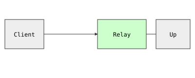

# s01: 最小的转发中继内核 — 中间站一个程序,所有调用方都走它

> Previous: — · Next: [s02](../s02_openai_protocol/)

> *"把请求转出去"* —— 转发是最朴素的网关。

> **Layer**：L1 协议与转发

## 问题

你的应用要调一家 LLM 厂商,但没有网关。每个调用方都得各自持有厂商 key、把厂商 URL 写死在代码里、再各自复制一份完全相同的请求调度逻辑。换厂商、轮换 key、看一眼流量——三件事任何一件都得改所有调用方。这就是靠人肉复制粘贴的中继,撑不过第一个下午。

解法就是在中间站一个程序。教程里其余所有内容——协议、流式、鉴权、配额、日志——都建立在这一个想法上,所以我们从最小可运行的版本讲起。

## 本章要做什么

要解决这个,中间站一个程序:它替调用方转发请求,key 和 URL 都藏在中继里。本章就把这个程序的最薄版本写出来:

1. **装 4 个包 —— 为什么是这 4 个**:`fastapi` 是用 Python 写 HTTP 路由的框架、`uvicorn` 是把 FastAPI 应用真正跑起来的服务器、`httpx` 是发出站 HTTP 请求的库(**为什么不用 `requests`**:`requests` 是同步的,而中继几乎所有时长都花在等上游,同步客户端每条在飞的请求要占一个 OS 线程,只有异步才扛得住并发)、`pydantic` 负责把进来的 JSON 转成 Python 对象(**为什么需要**:转发前先校验请求体格式,别让明显无效的请求白花一次网络往返)。
2. **写一条 `POST /relay` 路由 —— 为什么先自创路径**:调用方 POST 一段 JSON(带 `model` 和 `messages`)过来,中继原样转发给上游(默认 OpenAI 的 `chat/completions`),再把上游的 JSON 回复原样吐回。**为什么不直接用 OpenAI 的路径**:这一章只验证"中继能不能转发"这一件事;路径名留到 s02 换成 OpenAI 的,那时才谈生态兼容。
3. **把 key 放进环境变量 —— 为什么不让调用方传 key**:调用方永远看不到上游 key,中继自己读 `UPSTREAM_OPENAI_KEY` 并带上 `Authorization: Bearer ...` 头。**这是网关存在最核心的单一原因**:厂商 key 一旦下发到客户端,你就再也没法收回、轮换、限速、按用户计费。
4. **再加一条 `GET /health` —— 为什么这么早就要**:一条零依赖的存活探针,后面每章都在用(s15 的 Docker healthcheck 直接指向它),现在写好就不用回头补。

成品:`curl localhost:8001/health` 看到 `{"status":"ok"}`,`curl -X POST localhost:8001/relay -d '...'` 看到上游原样回复。后续 16 章都在这个最薄内核上往外加协议、流式、鉴权、限流、渠道、日志。

## 方案

一个进程:接住请求、转发出去、再把答复送回来。说白了就是一个针对入站 HTTP 请求的 `while True` 循环,循环体里只做一件事——转发。

`## 问题` 提了三件痛:每个调用方各拿一把 key (问题 #1)、各自把厂商 URL 写死 (问题 #2)、各自复制调度逻辑 (问题 #3)。这三件事里**任何一件都没有靠"客户端配合"能解决**——必须有一个独立进程隔离掉它们。下面这幅图把这三件事各放到一个角色里:

- **`Client` (调用方)** —— 在我们装上中继之前,这是干所有三件痛的角色;装上之后,这事就被中继隔走了,Client 只剩"我想调一次 LLM"。
- **`Relay` (本章要写的进程)** —— 把 #1 #2 #3 三件事的解决动作集中放在这里:接住 Client 的请求、藏好 key 与 URL、按 Client 要的形态回吐。Client 看不见 key,Upstream 看不见 Client。
- **`Upstream` (LLM 厂商)** —— 服务提供方。它从来不直接跟 Client 对话,只跟中继对话——中继带 key 来、中继带请求来。



下面这张 ASCII 流程图把同一段流程压成一行,作为上面的对照——图里仍是 `Client / Relay / Upstream` 三角色,箭头方向 = 请求/响应走向(`▶` 是请求,`◀` 是 JSON 响应),中间那一块就是本章要写的 `Relay`:

```
Client  ──POST /relay──▶  Relay  ──POST FORWARD_TARGET──▶  Upstream
        ◀──── JSON ────          ◀──────── JSON ─────────
```

中继在这一阶段只多做了两件事:持有上游 URL,也持有上游 key。调用方既不需要知道 URL,也不需要知道 key。

## 工作原理

**原理**: 一个 HTTP 请求从客户端进来, 它的生命周期是: 路由器按方法和路径挑出对应处理器 → 处理器用 schema 校验请求体 → 处理器构造出站请求转发给上游 → 等待上游回包 → 把上游回包按原样吐回客户端。整章所有部件都为这条主线服务。

**1. 一条 health 端点 (`GET /health`)** —— 零依赖探针, 后续每章沿用 (包括 s15 中 Docker 的健康检查)。

```python
@app.get("/health")
def health() -> dict:
    return {"status": "ok"}
```

**2. 一个 request schema (Pydantic `RelayRequest`)** —— 在花一次网络往返之前先校验 body 格式。本章只强制要求 `model` 和 `messages`;s02 才会把它变成真正的 OpenAI schema:

```python
class RelayRequest(BaseModel):
    model: str
    messages: list[dict]
```

**3. 一个 forwarder handler (`POST /relay`)** —— 实际跑"原理"那条主线。这里用的是 `httpx.AsyncClient`(支持异步的 HTTP 客户端库,与同步 requests 对应)——`requests` 的异步版本。异步不是装饰,是硬需求:中继几乎所有时长都花在等待上游上,阻塞式客户端每条在飞的请求都会占一个 OS 线程,吞吐几乎立刻见顶。

```python
@app.post("/relay")
async def relay(req: RelayRequest) -> dict:
    headers = {"Authorization": f"Bearer {UPSTREAM_KEY}"} if UPSTREAM_KEY else {}  # `Bearer`（HTTP 授权头格式：把令牌塞进 Authorization 头）
    async with httpx.AsyncClient(timeout=30.0) as client:
        try:
            r = await client.post(FORWARD_TARGET, json=req.model_dump(), headers=headers)
        except httpx.HTTPError as exc:
            raise HTTPException(status_code=502, detail=f"upstream error: {exc}") from exc
    if r.status_code >= 400:
        raise HTTPException(status_code=r.status_code, detail=r.text)
    return r.json()
```

逐行看:

- `headers = ... if UPSTREAM_KEY else {}` —— 中继负责注入厂商 key。调用方永远看不到。这正是网关存在最重要的单一原因。
- `timeout=30.0` —— 别继承一个无限大的默认值。挂住的上游不能反过来挂住中继。
- `except httpx.HTTPError` → **502**。传输层失败是我们上游的锅,不是调用方的;`502 Bad Gateway` 把这件事说得很清楚。
- `if r.status_code >= 400` —— 把上游的状态码原样透传。OpenAI 返回 429,调用方就应该看到 429,而不是被洗成 500。
- 每次请求都用 `async with` 关闭客户端(及其连接池(client 复用的 TCP 连接集合))。简单,但确实是浪费——s10 用一个共享连接池修掉这点。

配置全部走环境变量,所以任何一章都不用动代码就能切换目标:

```python
PORT           = int(os.getenv("PORT", "8001"))
FORWARD_TARGET = os.getenv("FORWARD_TARGET", "https://api.openai.com/v1/chat/completions")
UPSTREAM_KEY   = os.getenv("UPSTREAM_OPENAI_KEY", "")
```

## 运行

```sh
cd s01_minimal_relay
PORT=8001 python code.py
```

确认服务起好了没?打这个 curl——能返回 `{"status":"ok"}` 说明 FastAPI 进程在响应,中继逻辑也加载到内存了:

```sh
curl http://localhost:8001/health
# {"status":"ok"}
```

转发一次请求(先 `export UPSTREAM_OPENAI_KEY=...` 才有真实回复;不设 key 的话上游会回 401,而我们正好希望看到原样透传这个状态码):

```sh
curl -X POST http://localhost:8001/relay \
  -H 'content-type: application/json' \
  -d '{"model":"gpt-4o-mini","messages":[{"role":"user","content":"hi"}]}'
```

## → new-api 源码

| 这里 | new-api |
|---|---|
| `relay()` 路由 | `controller/relay.go` —— 把入站请求派发到上游的入口 |

新版本把这个单一路由泛化成 `Adaptor` 接口(`relay/channel/openai/adaptor.go`——按 channel 的适配器,负责构造出站请求并解析回包),每个厂商一套实现。s04 我们会走到同样的设计。

## 本章不做什么

- **没有鉴权** (任何能访问端口的人就能花你的 key)——任何能访问 8001 端口的人都能花你的 key。→ s05 在 chat 路由前加闸门。
- **没有流式** (逐 token 输出)——`r.json()` 等整个响应回来, 逐 token 输出做不到。→ s03 切 httpx 流式。
- **没有协议转换** (请求体原样转发)——请求体原样转发, 调用方必须自己会说上游方言。→ s02、s04。
- **没有配额 / 日志 / 指标** (按用户计费 / 调用历史 / 监控)——没法按用户计费、看不到调用历史、没有监控。→ s07、s11、s16。

## 已知限制

- **每请求新建连接池** (connection pool, client 复用的 TCP 连接集合)——`async with httpx.AsyncClient()` 每次都重连, 高并发下握手成本可观; 长连接客户端是生产答案。→ s10 修掉这点。
- **单上游** (单一上游厂商, 没有 channel 表 / 权重 / 故障切换)——`FORWARD_TARGET` 写死, 厂商挂了整套就挂。→ s10、s13。

## 设计选择

- **用 `except httpx.HTTPError` → 502 而非 500** ——传输失败是上游问题不是调用方问题, 502 比 500 更准确。
- **`r.status_code >= 400` 原样透传** ——OpenAI 返回 429 客户端应看到 429, 不洗成 500。

## 下章预告

`s01` 的 `/relay` 是我们自创的路径,LLM 生态已经统一讲 OpenAI 的 `chat.completions`。s02 把路由改成 `/v1/chat/completions`,免费拿到所有 OpenAI SDK。
