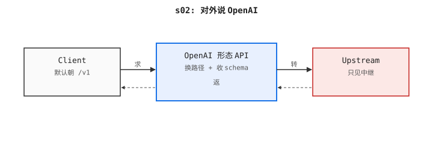

# s02: OpenAI 协议 — 改两个字节,免费拿到所有 SDK

> Previous: [s01](../s01_minimal_relay/) · Next: [s03](../s03_streaming_sse/)

> *"对外说 OpenAI"* —— 一个 wire format（线协议：网关与客户端约定的 JSON / HTTP 形态）兼容所有 SDK。

> **Layer**：L1 协议与转发

## 本章要做什么

入站面采用 OpenAI 的 `/v1/chat/completions` 路径和 JSON schema（schema：请求/响应的字段定义）。任何 OpenAI 客户端(官方 SDK、LangChain、LlamaIndex、终端里的 `curl`)都能原样对我们发起调用。学完你会拿到一个"客户端零修改"的网关。

## 上一章复盘

s01 验证了"中继"最少要有什么(自定义 `/relay` + 透传 JSON)。但这路径没人认识,任何 SDK 都得改。

## 在整体中的位置

所有调用方进来都先打到这条路径——这是网关对外唯一暴露的接口契约。

## 问题

`s01` 在自定义路径(`/relay`)上回答自定义 JSON 形态——每个客户端都得学习我们的方言。但 LLM 生态已经讲 OpenAI 的 `chat.completions` 契约,我们再花精力教世界我们这套私有格式,根本起不来。

一个网关只要对接 OpenAI 的面,就能免费拿到所有现有的客户端。这不叫妥协,这叫搭便车。

## 方案

两处调整,没有新基础设施:

1. **重命名路由**: `/relay` → `/v1/chat/completions`。这就是 OpenAI 暴露的路径,所有客户端都已经认识它。
2. **收紧请求 schema**,对齐 OpenAI 的负载:`model`、`messages: [{role, content}, ...]`(带 `min_length=1`),外加可选的 `temperature`、`max_tokens`、`stream`。其它字段留给上游去拒绝——中继不去发明字段。

转发循环本身逐字节不变。唯一改的是我们"在外头叫什么"。

下面这张 ASCII 流程图把本章的形态压成一行——图里有 `Client`、本章要写的 OpenAI 形态 API、远端 `Upstream` 三个角色,箭头方向 = 请求/响应走向(`▶` 发请求、`◀` 回 JSON),中间那一块就是本章要写的 OpenAI 形态 API(重命名路由 + 收窄 schema):

```
Client ──POST /v1/chat/completions──▶  OpenAI 形态的 API  ──POST FORWARD_TARGET──▶  Upstream
        ◀────── JSON ────────────                         ◀──────── JSON ───────────
```

下面这张架构图给读者一幅全局鸟瞰——图里仍是 `Client / OpenAI 形态 API / Upstream` 三个角色,请求自左向右、响应自右向左折返;中间那一块就是本章要写的 OpenAI 形态 API(重命名路由 + 收窄 schema):



## 工作原理

Pydantic 模型承担 schema;处理器通过 `common/json` 工具做编解码(marshal / unmarshal_str:s02 唯一入口,前者输出紧凑 UTF-8 字节,后者通过 Pydantic 模型解线包),保证 JSON 来回的规矩和别的章节完全一致:

```python
class ChatMessage(BaseModel):
    role: str
    content: str


class ChatCompletionRequest(BaseModel):
    model: str
    messages: list[ChatMessage] = Field(min_length=1)  # Field(min_length=...):Pydantic 字段约束,列表至少 1 条
    temperature: float | None = None
    max_tokens: int | None = None
    stream: bool = False
```

路由就是把 `s01` 的 relay 换了个 URL,加了个类型化的 body。`model_dump(exclude_none=True)` (`exclude_none=True`：序列化时剥掉 None 字段,避免空字段落到线上)在序列化前剥掉可空字段,所以不传 `temperature` 的调用方不会在线上传出一个空的 JSON 键。`response_model=ChatCompletionResponse` (response_model:FastAPI 装饰器参数,声明响应类型做自动校验) 让响应同样走 schema 校验:

```python
@app.post("/v1/chat/completions", response_model=ChatCompletionResponse)
async def chat_completions(req: ChatCompletionRequest) -> dict:
    headers = {"Authorization": f"Bearer {UPSTREAM_KEY}"} if UPSTREAM_KEY else {}
    body = marshal(req.model_dump(exclude_none=True))
    async with httpx.AsyncClient(timeout=30.0) as client:
        try:
            r = await client.post(
                FORWARD_TARGET, content=body, headers={**headers, "content-type": "application/json"}
            )
        except httpx.HTTPError as exc:
            raise HTTPException(status_code=502, detail=f"upstream error: {exc}")
    if r.status_code >= 400:
        raise HTTPException(status_code=r.status_code, detail=r.text)
    return unmarshal_str(r.text, ChatCompletionResponse).model_dump()
```

`common/json.py` 的 `marshal` 和 `unmarshal_str` 是业务代码唯一允许使用的 JSON 入口:`marshal` 输出紧凑 UTF-8 字节(无空格、`ensure_ascii=False`);`unmarshal_str` 通过 Pydantic 模型解析线包,边界处的响应校验就完成了。把它们集中到一个模块,正好对齐 new-api 的 `common/json.go` 规则。

为什么要 `exclude_none=True`?OpenAI 的 API 把"省略的可选字段"理解为"服务端用默认"。`temperature: null` 是另一种请求——它强制传 `null`,从而绕过上游默认。剥掉字段才能保住调用方的本意。

## 运行

```sh
cd s02_openai_protocol
PORT=8002 python code.py
```

确认活着:

```sh
curl http://localhost:8002/health
# {"status":"ok"}
```

转发一次(先 `export UPSTREAM_OPENAI_KEY` 才有真实回复;不设的话上游会返回 401,我们正好希望看到原样透传这个状态码):

```sh
curl -X POST http://localhost:8002/v1/chat/completions \
  -H 'content-type: application/json' \
  -d '{"model":"gpt-4o-mini","messages":[{"role":"user","content":"hi"}]}'
```

## 测试

```sh
pytest tests/test_s02_openai_protocol.py -v
```

上游用 `respx` mock(`tests/conftest.py` 的 `upstream_openai` 固定器),所以套件能离线跑,同时仍断言真实的线协议形态。两个测试覆盖如下:

- `test_openai_route_exists` —— 合法负载被转发,返回带 `choices` 键的 body。
- `test_request_validation_rejects_missing_messages` —— 缺 `messages` 时,Pydantic 边界返回 `422`,根本不会发出任何网络请求。

## → new-api 源码

| 这里 | new-api |
|---|---|
| `ChatCompletionRequest` 模型 | `relay/channel/openai/adaptor.go` —— OpenAI 线协议和内部 `relay` 结构之间的入参/响应 DTO 转换 |
| `chat_completions` 路由 | `relay/relay.go` —— 把入站请求派发到 OpenAI 的 `Adaptor`（new-api 术语：厂商适配器接口） |
| `model_dump(exclude_none=True)` | `relay/constant.go` —— 转发前由它按 channel 做归一化,丢掉空字段 |

new-api 把这套模式抽象成 `Adaptor` 接口(`relay/channel/openai/adaptor.go`),每个厂商一个实现。s04 我们会走到同样的设计。

## 取舍

明确**没有**做的事:

- **没有 Claude / Gemini 的协议转换**。请求体还是 OpenAI 形态,所以 Claude 风格的 `system` 块、或 Gemini 的 `contents` 数组都会被原样转发、再被上游拒绝。→ s04。
- **没有流式**。`r.json()` 等完整 body,逐 token 输出不可能。→ s03。
- **没有鉴权、配额、日志、指标**。→ s05、s07、s11、s16。
- **每请求新建一个连接池**。正确,但慢;长连接客户端才是生产答案。→ s10。
- **没有重试和退避**。一次短暂的上游抖动会以 502 暴露给调用方。→ s13。

## 下章预告

s02 客户端拿到完整 JSON 才开始渲染,7 秒延迟。s03 把协议升级到逐 token 流式,客户端首字延迟降到几百毫秒。
