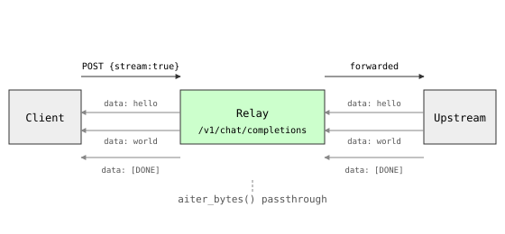

# s03: Streaming SSE Passthrough

> Previous: [s02](../s02_openai_protocol/) · Next: [s04](../s04_multi_provider/)
> **Adds**: when `stream=true`, the relay opens an `httpx` streaming client and forwards SSE chunks verbatim so the client sees first-token latency. Non-streaming requests still return JSON as in s02.

## The Problem

`s02` waits for the full response with `r = await client.post(...)` and then `r.json()`. For a chat completion that produces 200 tokens at 30 tok/s, the client stares at a blank screen for almost seven seconds before anything renders. Token-by-token delivery is the only way to make chat feel responsive; without it, every chat UX built on the relay is broken.

The upstream already speaks Server-Sent Events (SSE) — `Content-Type: text/event-stream`, frames of `data: {...}\n\n` terminated by `data: [DONE]\n\n`. The relay must not buffer, parse, or reshape those bytes; it must hand them straight through.

## The Solution

One branch on `req.stream`:

- **stream=false**: the same `await client.post(...)` path from s02, returns `JSONResponse`.
- **stream=true**: open `httpx.AsyncClient.stream(...)`, return a FastAPI `StreamingResponse(media_type="text/event-stream")`, and yield bytes with `async for chunk in upstream.aiter_bytes()`. Two response headers matter: `cache-control: no-cache` and `x-accel-buffering: no` (the latter tells nginx not to buffer, since reverse proxies often hold SSE bodies until a threshold).

```
Client ──POST /v1/chat/completions {stream:true}──▶  Relay  ──POST FORWARD_TARGET──▶  Upstream
        ◀──── SSE chunk 1 ────                   ◀──── SSE chunk 1 ────
        ◀──── SSE chunk 2 ────                   ◀──── SSE chunk 2 ────
        ◀──── SSE [DONE] ────                    ◀──── SSE [DONE] ────
```



## How It Works

The relay reuses `s02`'s request schema and the `marshal` helper for the outbound body; the only new code is a streaming relay generator and a conditional response:

```python
async def _relay_stream(req: ChatCompletionRequest) -> AsyncIterator[bytes]:
    headers = {"Authorization": f"Bearer {UPSTREAM_KEY}"} if UPSTREAM_KEY else {}
    body = marshal(req.model_dump(exclude_none=True))
    timeout = httpx.Timeout(connect=10.0, read=None, write=10.0, pool=10.0)
    async with httpx.AsyncClient(timeout=timeout) as client:
        async with client.stream(
            "POST", FORWARD_TARGET, content=body,
            headers={**headers, "content-type": "application/json", "accept": "text/event-stream"},
        ) as upstream:
            async for chunk in upstream.aiter_bytes():
                yield chunk
```

`httpx` reads whatever the upstream sends without waiting for the full body; `yield chunk` pushes those bytes straight into FastAPI's response, which flushes them to the wire. `aiter_bytes()` returns whatever the upstream happens to have buffered — there is no assumption of one-SSE-frame-per-chunk.

The `accept: text/event-stream` header is a courtesy: most upstreams respect it but do not require it, since the body shape already signals streaming.

```python
@app.post("/v1/chat/completions")
async def chat_completions(req: ChatCompletionRequest):
    if req.stream:
        return StreamingResponse(
            _relay_stream(req),
            media_type="text/event-stream",
            headers={"cache-control": "no-cache", "x-accel-buffering": "no"},
        )
    # non-streaming path unchanged from s02
    ...
```

Why two response headers?

- `cache-control: no-cache` — intermediaries must not serve a cached copy of an open-ended stream.
- `x-accel-buffering: no` — disables nginx's `proxy_buffering`, otherwise nginx holds the body until it fills a buffer and SSE "freezes" for the client.

## Run It

```sh
cd s03_streaming_sse
PORT=8003 python code.py
```

Health check:

```sh
curl http://localhost:8003/health
# {"status":"ok"}
```

Non-streaming (same as s02):

```sh
curl -X POST http://localhost:8003/v1/chat/completions \
  -H 'content-type: application/json' \
  -d '{"model":"gpt-4o-mini","messages":[{"role":"user","content":"hi"}]}'
```

Streaming — the `-N` flag disables curl output buffering so you see chunks arrive in real time:

```sh
curl -N -X POST http://localhost:8003/v1/chat/completions \
  -H 'content-type: application/json' \
  -d '{"model":"gpt-4o-mini","messages":[{"role":"user","content":"hi"}],"stream":true}'
```

With `UPSTREAM_OPENAI_KEY` unset, the upstream returns 401 — that's fine, it confirms the relay forwarded the request. Set `UPSTREAM_OPENAI_KEY` to a real key for actual streamed text.

## Tests

```sh
pytest tests/test_s03_streaming_sse.py -v
```

The `upstream_openai` fixture from `tests/conftest.py` provides a respx mock; the streaming test overrides the default JSON response with an SSE payload and asserts the bytes reach the client. Coverage:

- `test_streaming_returns_sse_chunks` — `stream=true` request returns the upstream's SSE chunks verbatim (`hello `, `world`, `[DONE]`).
- `test_non_streaming_still_works` — omitting `stream` keeps the JSON response path.

## → new-api source

| Here | new-api |
|---|---|
| `_relay_stream` / `StreamingResponse` | `relay/sse.go` — chunked SSE writer (`w.Write` per `aiter_bytes`) and stream lifecycle |
| `accept: text/event-stream` | `relay/relay.go` — stream negotiation on `req.Stream` |
| `x-accel-buffering: no` | `middleware/proxy.go` — disables nginx buffering for the `/v1` routes |

new-api splits this into two stages: the SSE chunker that splits the upstream body into events, and the channel adaptor that knows the per-provider frame format. We collapse both into one passthrough for now and split in s04 when we add Claude/Gemini adaptors.

## Trade-offs

What we deliberately did **not** do:

- **No frame parsing or reformatting.** We forward raw bytes; if the upstream ever changes its SSE shape (Anthropic uses `event:` lines), the relay breaks. → s04 introduces per-provider adaptors.
- **No client-disconnect propagation.** If the caller hangs up mid-stream, we keep reading from the upstream until it closes, wasting tokens and money. → s08 wires `request.is_disconnected()` into the generator.
- **No cancellation of the upstream request.** Same problem, different shape. → s08.
- **A fresh connection pool per request.** A long-lived `httpx.AsyncClient` with shared limits is the production answer. → s10.
- **No retries, backoff, auth, quota, logging, or metrics.** → s05, s07, s11, s13, s16.