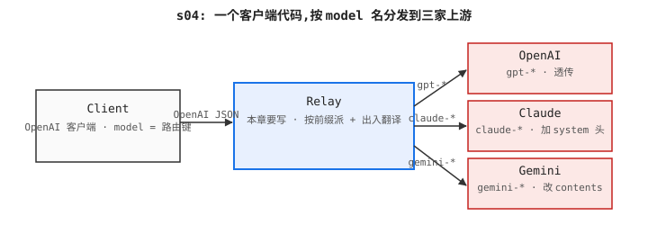

# s04: 多厂商适配器分派 — 按 model 前缀挑适配器,请求体各转各的

> Previous: [s03](../s03_streaming_sse/) · Next: [s05](../s05_api_key_auth/)

> *"前缀选 provider"* —— model 名就是路由键。

> **Layer**：L1 协议与转发

## 问题

`s02` 和 `s03` 把一份 OpenAI 形态的 JSON body 原样转发。上游就是
OpenAI 时一切相安无事——但 OpenAI 期望的 body(`model`、`messages`、
`temperature`、可选的 `stream`)并不是 Anthropic 或 Google 期望的样子。Claude 要 `x-api-key`、`anthropic-version` 请求头,以及每个请求都要的 `max_tokens`。Gemini 要一个 `contents: [{role, parts: [{text}]}]` 数组,以及放在 URL 查询串里的 API key。

如果把 OpenAI 的 JSON 直接透传到 Claude,上游就回 `400 invalid request`;透传到 Gemini 也一样。一个客户端、一套线协议、三个互不兼容的上游——这就是 s04 要解决的问题。

## 本章要做什么

s02/s03 假设上游就是 OpenAI,所以请求体原样转发;但客户端还可能想打 Claude 或 Gemini,各家要的请求形态完全不一样——Claude 要 `x-api-key` + `anthropic-version` 头 + 顶层 `max_tokens`,Gemini 要 `contents: [{role, parts: [{text}]}]` 数组 + URL 查询串里的 API key。一份 OpenAI 形态 body 直接打到 Claude 上游会被回 `400 invalid request`。把 OpenAI 写死在上游,任何一家挂了整条服务就 502。

要解决这个,把"按前缀挑适配器"这层抽象插在 s02 转发循环前面:客户端始终说 OpenAI 形态,网关按 `model` 前缀分给三家上游,响应再翻回 OpenAI 形态,客户端不需要知道答的是哪家。本章就做这一件事:

1. **定义 `Provider` 抽象基类 —— 为什么必须有这个抽象**:每家厂商 URL/auth/响应 schema 都不一样,**为什么不直接三个 if-else 写死在路由里**:加新厂商等于改路由;**为什么方法签名是 `(req) → (url, headers, body)` + `(payload) → dict`**:这样 `chat_completions` 路由只看到"出站 + 回包翻成 OpenAI 形态",不知道厂商是谁;翻牌写到 `from_upstream` 一个方法里,后续 s05/s07 加鉴权、配额只动路由这一层,不动适配器。
2. **`pick_provider(model)` 按前缀分派 —— 为什么靠前缀而不是配置文件**:客户端发请求时 `model` 已经在 body 里了,运维不用另维护一份"哪个 model 走哪家"的配置,**为什么不靠 `(channel, model)` 元组**:`pick_provider` 按字符串前缀一行就能搞定,new-api 的 channel 表是另一种思路(s04 取舍节会展开)。
3. **每个 provider 只翻译"真正不一致的部分" —— 为什么不全量重写**:`model` / `messages` 这种共有字段原样透传,只构造厂商专属的 `system` 字段、`max_tokens` 默认值、`contents[]` 数组形态;**为什么响应也翻**:客户端只认 OpenAI 形态,Claude 响应里的 `content[].text` 必须翻成 `choices[0].message.content`、Gemini 的 `candidates[].content.parts[].text` 也是;否则 s02 的客户端代码就破。

成品:一份 OpenAI 形态客户端代码能同时调 OpenAI / Anthropic / Gemini,客户端零修改,单家挂不影响另外两家。后续 s05 在这一章分派表外面加 API key 鉴权,s07 加按用户配额,s11 把每个 provider 的调用日志分别落表。

## 方案

引入一个 `Provider` 抽象基类 (`ABC`,abstract base class,要求子类实现规定方法),每个上游一个具体实现。每个 provider 只做两件事:

1. **把 OpenAI 请求翻译成自家线协议** (`to_upstream`)。
2. **把自家响应翻回 OpenAI 形态** (`from_upstream`)。

路由处理器通过 `pick_provider(model)` 按模型名前缀挑出对应适配器(`Adaptor`,new-api 术语:厂商适配器接口),然后沿着这个适配器转发请求。客户端看到的 `/v1/chat/completions` 入口和 JSON 形态完全一样,无论最后答的是哪家上游。

`## 问题` 提了两件痛:OpenAI 形态 body 直打到 Claude / Gemini 会被回 400 (痛点 #1)、单家挂了整套服务就 502 (痛点 #2)。这两件事**任何一件**都没法靠"客户端按厂商分流"能解决——必须由网关按 model 前缀自动分派并翻译。下面这幅图把这三件事各放到一个角色里:

- **`Client` (任意 OpenAI 客户端)** —— 装上分派层之前,这是被迫按厂商分流改代码的角色;装上之后,这事被网关解了——客户端发什么 model,网关就派给哪家,客户端零修改。
- **`Relay` (本章要写的分派层)** —— 把痛点 #1 #2 的解决动作集中放在这里:按 `model` 前缀挑 provider,用 `to_upstream` 把 OpenAI body 翻成各家方言,用 `from_upstream` 把各家响应翻回 OpenAI 形态。Client 始终说 OpenAI 形态,Upstream 始终说自家形态。
- **`Provider` (OpenAI / Claude / Gemini 三选一)** —— 厂商专属的执行者。OpenAI 形态透传;Claude 加 `x-api-key` + `anthropic-version` + 顶层 `max_tokens`;Gemini 改 `contents[]` 形态 + URL 查询串里的 API key。单家挂了不影响另外两家。

下面这张 ASCII 流程图把分派路径压成一行——和下面那张架构图相对照:上面这张是单跳时序,下面那张是角色拓扑,中间那块都是"按模型名前缀选":

```
Client ──POST /v1/chat/completions──▶  Relay(按模型名前缀选)  ──POST upstream──▶  Provider
        ◀────── OpenAI JSON ─────────                                    ◀──── JSON ────
```

下面这张架构图给读者一幅全局鸟瞰——图里有 `Client`、`Relay`、以及根据模型名前缀动态选出的 `Provider` 三个角色,箭头方向 = 请求/响应走向(`▶` 是请求,`◀` 是 JSON 响应),中间那一块就是本章要写的 Relay,按模型名挑 adapter:



## 工作原理

**原理**: 一个 HTTP 请求从客户端进来, 它的生命周期是: 路由器按 `/v1/chat/completions` 路径挑出 chat 处理器 → 处理器用 OpenAI schema 校验请求体 → `pick_provider(req.model)` 按 `model` 前缀挑出 `OpenAIProvider` / `ClaudeProvider` / `GeminiProvider` 之一 → `provider.to_upstream` 把 OpenAI body 翻成该厂商方言 + 出站 headers → httpx 把请求发到该厂商 URL → 等待回包 → `provider.from_upstream` 把厂商响应翻回 OpenAI 形态 → 吐回客户端。整章所有部件都为这条主线服务。

**1. 一个 `Provider` ABC (Python `ABC` + `@abstractmethod`)** —— `name` + `to_upstream(req) → (url, headers, body)` + `from_upstream(payload) → dict` 三个方法。每个上游一个具体实现。路由处理器只看到"出站 + 回包翻成 OpenAI 形态",不知道厂商是谁;这样加新厂商 = 加一个 `Provider` 子类,路由不动。

**2. 一个 `pick_provider(model)` 分派器** —— 按 `model.startswith(...)` 一行一条 if 挑 provider。`gpt-` / `o` 走 OpenAI、`claude-` 走 Claude、`gemini-` 走 Gemini;其它一律 `400 unknown model`。客户端发请求时 `model` 已经在 body 里,运维不用另维护配置。

**3. 三个 provider 实现 (`OpenAIProvider` / `ClaudeProvider` / `GeminiProvider`)** —— 每个 provider 只翻译"真正不一致的部分":共有字段 (`model` / `messages`) 原样透传,厂商专属字段显式构造。响应被折叠回 OpenAI 的 `chat.completion` 形态。

适配器表是本章的核心:

| 模型名前缀 | Provider | 上游 URL |
|---|---|---|
| `gpt-` 或 `o` | `OpenAIProvider` | `https://api.openai.com/v1/chat/completions` |
| `claude-` | `ClaudeProvider` | `https://api.anthropic.com/v1/messages` |
| `gemini-` | `GeminiProvider` | `https://generativelanguage.googleapis.com/v1beta/models/{model}:generateContent?key=…` |
| 其它 | — | `400 unknown model` |

```python
class Provider(ABC):
    name: str

    @abstractmethod
    def to_upstream(self, req: dict) -> tuple[str, dict, dict]: ...

    @abstractmethod
    def from_upstream(self, payload: dict) -> dict: ...


def pick_provider(model: str) -> Provider:
    if model.startswith("gpt-") or model.startswith("o"):
        return OpenAIProvider()
    if model.startswith("claude-"):
        return ClaudeProvider()
    if model.startswith("gemini-"):
        return GeminiProvider()
    raise ValueError(f"unknown model: {model}")
```

路由处理器几乎和 s02 一模一样——新增的只有 `pick_provider(req.model)`
和夹在原 `httpx.AsyncClient.post` 前后的 `provider.to_upstream` /
`provider.from_upstream`:

```python
@app.post("/v1/chat/completions")
async def chat_completions(req: ChatCompletionRequest):
    try:
        provider = pick_provider(req.model)
    except ValueError as exc:
        raise HTTPException(status_code=400, detail=str(exc))
    payload = req.model_dump(exclude_none=True)
    payload["_api_key"] = _key_for(provider.name)
    url, headers, upstream_body = provider.to_upstream(payload)
    body_bytes = marshal(upstream_body)
    async with httpx.AsyncClient(timeout=30.0) as client:
        try:
            r = await client.post(url, content=body_bytes, headers=headers)
        except httpx.HTTPError as exc:
            raise HTTPException(status_code=502, detail=f"upstream error: {exc}")
    if r.status_code >= 400:
        raise HTTPException(status_code=r.status_code, detail=r.text)
    translated = provider.from_upstream(json.loads(r.text))
    return JSONResponse(translated)
```

API key 来自各家专属的环境变量(`UPSTREAM_OPENAI_KEY`、
`UPSTREAM_CLAUDE_KEY`、`UPSTREAM_GEMINI_KEY`),通过 `_key_for
(provider.name)` 解析、在适配器看到之前塞进 payload 的 `_api_key` 槽
里。下划线前缀保证这个字段不会出现在序列化后的线协议里。

## 运行

```sh
cd s04_multi_provider
PORT=8004 python code.py
```

确认三家适配器路径都能响应?打这条 curl——能拿到 `{"status":"ok"}` 说明 FastAPI 进程在响应、`Provider` ABC 和三家 provider 实现都加载到内存里了;再分别用 `model: gpt-...` / `claude-...` / `gemini-...` 各发一个请求,被 `pick_provider` 派到对应适配器、再被 `to_upstream` 翻译后转发,即说明三家适配器都在响应:

```sh
curl http://localhost:8004/health
# {"status":"ok"}
```

三家厂商,一份请求形态(把对应的 `UPSTREAM_*_KEY` 设上才有真实回复;不设的话上游会回 401,我们正好希望中继把它原样透传):

```sh
# OpenAI
curl -X POST http://localhost:8004/v1/chat/completions \
  -H 'content-type: application/json' \
  -d '{"model":"gpt-4o-mini","messages":[{"role":"user","content":"hi"}]}'

# Claude
curl -X POST http://localhost:8004/v1/chat/completions \
  -H 'content-type: application/json' \
  -d '{"model":"claude-3-5-sonnet-20241022","messages":[{"role":"user","content":"hi"}]}'

# Gemini
curl -X POST http://localhost:8004/v1/chat/completions \
  -H 'content-type: application/json' \
  -d '{"model":"gemini-1.5-flash","messages":[{"role":"user","content":"hi"}]}'
```

## → new-api 源码

| 这里 | new-api |
|---|---|
| `Provider` ABC | `relay/channel/adapter.go` —— 每个 channel 都实现的 `Adaptor` 接口 |
| `OpenAIProvider` | `relay/channel/openai/adaptor.go` —— OpenAI 专属的请求/响应转换 |
| `ClaudeProvider` | `relay/channel/claude/adaptor.go` —— Anthropic Messages 的转换 |
| `GeminiProvider` | `relay/channel/gemini/adaptor.go` —— Google `generateContent` 的转换 |
| `pick_provider(model)` | `controller/relay.go` —— 通过检查模型名把入站请求派发到对应 channel |

new-api 走得更远:它有一个 `GetAdaptor(meta)` 工厂,把 `(channel,
model)` 元组映射到适配器实例;另外每 channel 都有 `Key` 模式(我们这
里硬编码的 `_*_KEY` 环境变量变成运行时可配置)。Go 端每家厂商都有流
式适配器——见下面的取舍。

## 本章不做什么

- **没有流式翻译** (在流式响应里逐帧把各家 SSE 翻成 OpenAI 形态)——当 `stream: true` 时, 我们仍然等整个响应再返回 JSON。三家厂商的 SSE 线协议在流中段不同 (OpenAI 推 `data: {...}\n\n`, Claude 推 `event: …` 行, Gemini 推 `data: [array,…]`), 真正的流式翻译是另一道独立的设计题。→ s05+。
- **没有鉴权、配额、日志、指标** (按用户计费 / 调用历史 / 监控)——任何能访问 8004 端口的人都能花 key, 看不到调用历史。→ s05、s07、s11、s16。

## 已知限制

- **OpenAI 路径没有真正的 `system` 翻译** (把 `messages` 里的 `system` 消息正确提取为 Claude 顶层 `system` 字段)——OpenAI 客户端可以把 `system` 放在 `messages` 里 (`{"role": "system", "content": "…"}`); Claude 想要的是顶层 `system` 字段。适配器做了顶层 `system` 的提取, 但 `messages` 里的 `system` 这条分支还没有处理。
- **按前缀路由很脆** ——一个叫 `open-mistral-7b` (真实的 Mistral 模型名) 的模型会被 `o` 匹配到 OpenAI provider——然后 401 或 400。new-api 的解法是按 `channel` 路由, 而不是按 `model`, 所以运维在配置阶段就声明"这个模型走 Anthropic"。
- **每请求新建连接池** (connection pool, client 复用的 TCP 连接集合)——`async with httpx.AsyncClient()` 每次都重连, 高并发下握手成本可观; 长连接客户端是生产答案。→ s10 修掉这点。
- **没有重试 / 退避** ——一次短暂的上游抖动会以 502 暴露给调用方。→ s13。

## 设计选择

- **按 `model` 前缀分派而不是 channel 表** ——客户端发请求时 `model` 已经在 body 里, 运维不用另维护"哪个 model 走哪家"的配置; new-api 的 channel 表是另一种思路 (按 `channel` 路由, 运维显式声明), 我们取更轻的一端。代价是 `open-mistral-7b` 这种冲突模型会被错派。
- **`Provider` ABC 而不是三个 if-else** ——加新厂商 = 加一个子类, 路由不动;`to_upstream` / `from_upstream` 两个方法把"出站翻译 + 回包翻译"封装到适配器里, 路由只看到 (url, headers, body) → OpenAI 形态。

## 下章预告

s04 任何能访问的客户端都能打网关,只要有路径就行。s05 加 API key 鉴权,把"匿名"打掉。