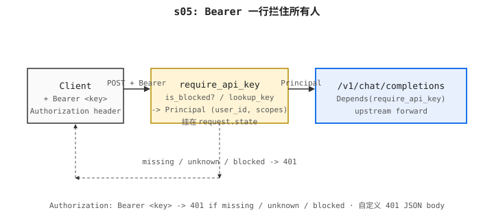

# s05: API Key 鉴权 — 一道 Bearer 守门,401 把匿名打掉

> Previous: [s04](../s04_multi_provider/) · Next: [s06](../s06_token_counting/)

> *"Bearer 一行拦住所有人"* —— header 一行守住所有下游。

> **Layer**：L2 鉴权与身份

## 问题

s01–s04 都会愉快地转发一切长得像 chat completion 的请求。根本没有"谁在调"这件事:谁能摸到中继,谁就能花掉你的上游配额,也没有地方挂上按用户的限速、计费、scope。中继是完全敞开的。

## 本章要做什么

s01–s04 都会愉快地转发一切长得像 chat completion 的请求。根本没有"谁在调"这件事:谁能摸到中继,谁就能花掉你的上游配额,也没有地方挂上按用户的限速、计费、scope。中继是完全敞开的。**我们在 chat 路由前面加一道 Bearer 闸门**:每个 `/v1/chat/completions` 请求都先过 `Depends(require_api_key)`,不知道 / 不认识 / 被封禁的 key 一律 `401` 打掉,通过之后才进转发循环。本章就写这一道闸门:

1. **写 `require_api_key` 依赖 —— 为什么必须用 Depends 而不是中间件**:`Depends`(FastAPI 依赖注入:路由处理器之前自动跑的函数)是 FastAPI 的官方可测试注入点,**为什么不用 ASGI 中间件**:中间件装上之后对所有路由一刀切,新加路由默认就被它拦了——想要"只对 chat 路径生效"得在中间件里再写一层 if/else,反而更绕;`Depends` 写在路由声明里,新路由不挂就默认开放,显式优于隐式。
2. **读 `Authorization: Bearer <key>` —— 为什么是 Bearer 头而不是 query 串**:Bearer 头一行密码,放请求头里、**为什么不放 URL**:`Authorization: Bearer sk-xxx` 是 OAuth 2.0 标准放密钥的地方,放 URL 会被 nginx access log、上游 SLA 日志、浏览器历史全留下来——密钥不应穿过日志系统;**为什么 split 方式是 `startswith("Bearer ")` + `removeprefix(...)`**:大小写不敏感但前缀格式严格,空格分隔切干净。
3. **查 `storage.lookup_key` + `storage.is_blocked` —— 为什么分两步**:先查黑名单(`is_blocked`)、再查白名单(`lookup_key`),**为什么不合并成一个 if**:`is_blocked` 是个生产接缝(未来接 Redis `banned:` 集合),即使白名单查不到,被显式封禁的 key 也应被特殊处理(返回 `key blocked` 而不是 `unknown key`,运维能区分意图);**为什么 storage 是独立模块**:和 s04 把 adapter 抽出来的理由一致——`code.py` 不该知道 key 存在哪里,只调 `lookup_key(key)` 拿 `Principal`。
4. **把 `Principal` 挂到 `request.state` —— 为什么挂到 state 而不是 return**:`Depends` 把 `principal` 当返回值也能拿到,但**为什么还要写 `request.state.principal = principal`**:后续中间件 / handler(限速 s08 / 配额 s07 / 日志 s11)都从 `request.state.principal` 拿身份,不一定走 Depends 链(`Principal` 也要够轻,本教程里只装 `user_id` + `scopes`)。

成品:`curl -i .../v1/chat/completions`(没有 `Authorization` 头)回 `401 missing bearer token`;注册一个 key `sk-demo` 再带 `authorization: Bearer sk-demo` 发请求,转发生效。后续 s07 在闸门之后接按用户的配额,s08 在闸门之后接按用户的限速,s11 把每次调用的 `user_id` 写进日志;chat 路径的鉴权链路到这里定型。

**双轨鉴权其一**:s05 的 Bearer API key 守 chat 路径;dashboard / admin 路径另由 s09 的 `JWT(JWT, JSON Web Token, 一种签名令牌格式)`鉴权把关(见 s09 README)。两条并存、不替代:chat 路径始终走 API key,dashboard / admin 始终走 JWT。

## 方案

现在的场景是:`## 问题` 提了一件痛——任何能摸到端口的人都能花你的上游 key、按用户限速 / 计费 / scope 全挂不上去,因为连"谁在调"这件事都不知道——这件事客户端自觉搞不定、运维拉名单也搞不定,必须由网关在 chat 路由前装一道闸门,不认识 key 一律 401。

**要解决这个——我们在网关里引入一个 `Principal`** —— 当前请求代表的用户身份(`user_id` + `scopes` 元组,`scopes` 是权限标签),由 `Depends(require_api_key)` 这道闸门查表后挂到 `request.state` 上。闸门的动作分四步:

1. 从请求里读 `Authorization: Bearer <key>`。
2. 检查 `storage.is_blocked(key)`(黑名单查询钩子,返回是否被封禁——未来接 Redis;本章永远返 `False`)。
3. 在 `storage.lookup_key` 里查这个 key,查不到抛 `401`。
4. 成功的话,把 `Principal` 挂到 `request.state`,供下游中间件使用。

存储层(`storage.py`)本章是进程内的;真实实现会换 Redis + 数据库。`storage.py` 和 `code.py` 的这种拆分,正好对齐 new-api 在 `model/`(持久化)和 `middleware/`(HTTP 装配)之间的切分。

下面这幅图把闸门放到三个角色里:

- **`Client` (调用方)** —— 在装闸门之前,这是干"谁都能打"这件事的角色;装上之后,这事被闸门解了——Client 只剩"我必须带 `Authorization: Bearer sk-...` 才能过"。
- **`Relay` (本章要写的闸门 + 转发)** —— 把痛点的解决动作集中放在这里:`Depends(require_api_key)` 在 chat 处理器之前跑,读 `Authorization` 头、查 key 表、不认识返 401,通过则挂 `Principal` 到 `request.state` 再进入原有转发循环(s04 那条)。Client 看不见 key 字符串后面是谁,Upstream 看不见 Client 持了哪把 key。
- **`Upstream` (LLM 厂商)** —— 服务提供方。它仍然只见中继、不见 Client;中继带不带 key、挂不挂 `Principal`,对上游透明。

下面这张 ASCII 流程图画鉴权边界,和下面那张架构图相对照——上面这张是单跳时序,下面那张是角色拓扑,中间那块都是 `require_api_key` 闸门:

```
Client ──POST + Bearer ──▶  require_api_key  ──▶  /v1/chat/completions  ──▶  Upstream
                                │ 401 如果缺失 / 未知 / 被封
                                ▼
                          Principal 挂在 request.state
```

下面这张架构图给读者一幅全局鸟瞰——图里有 `Client / require_api_key / 上游` 几个角色,请求自左向右、响应自右向左折返;中间那一块 `require_api_key` 闸门就是本章要写的代码:读 Bearer 头、查 key、挂 Principal:



## 工作原理

**原理**: 一个 HTTP 请求从客户端进来, 它的生命周期是: 路由器按 `/v1/chat/completions` 路径挑出 chat 处理器 → 在 handler 之前 `Depends(require_api_key)` 自动跑 → 闸门读 `Authorization` 头剥出 Bearer 字符串 → 先查 `is_blocked` 黑名单再查 `lookup_key` 白名单 → 不通过抛 `HTTPException(401)` 在 handler 之前就拦掉 → 通过则把 `Principal` 挂到 `request.state` 再进原 chat 处理器 → 处理器做 s04 的 `pick_provider` + 转发。所有部件都围着这条主线展开。

**1. 一个 auth dependency (`require_api_key`,挂在 `dependencies=[Depends(...)]`)** —— FastAPI 在 chat handler 之前自动调它,从 `request.headers` 抽 `Authorization: Bearer <key>`,剥前缀、去空白。`Depends` (FastAPI 依赖注入:路由处理器之前自动跑的函数) 是 FastAPI 官方推荐的注入点:可单元测试、新加路由默认是开放的(不会偷偷被闸上)。`dependencies=[Depends(require_api_key)]` 让每个 handler 自己声明"我要这道闸门",全局栈不被偷偷改动。

**2. 一个 API key storage (`storage.py` 进程内 dict + `_keys`)** —— `register_key(user_id, key, scopes)` / `lookup_key(key) → Principal | None` / `is_blocked(key) → bool` 三个函数组成的最小存-查-禁 接缝。`Principal` (当前请求代表的用户身份与权限) 只装 `user_id` + `scopes` 元组——够轻,够挂到 `request.state` 供下游中间件用。`is_blocked` 永远返 `False`,是留给未来接 Redis `banned:` 集合的接缝。

**3. 一个 chat route handler (`POST /v1/chat/completions`,带 `dependencies=[Depends(require_api_key)]`)** —— 实际跑"原理"那条主线的下半段。它不需要任何鉴权代码——闸门已在 handler 之前把 `Principal` 挂到 `request.state`,handler 只调 `pick_provider` + 转发(s04 那条逻辑逐行保留)。

依赖本身就是一个函数:

```python
def require_api_key(request: Request) -> Principal:
    auth = request.headers.get("authorization", "")
    if not auth.startswith("Bearer "):
        raise HTTPException(status_code=401, detail="missing bearer token")
    key = auth.removeprefix("Bearer ").strip()
    if is_blocked(key):
        raise HTTPException(status_code=401, detail="key blocked")
    principal = lookup_key(key)
    if principal is None:
        raise HTTPException(status_code=401, detail="unknown key")
    request.state.principal = principal
    return principal
```

它通过 `dependencies=[Depends(require_api_key)]` 挂到 chat-completion 路由上——处理器自己不需要关心鉴权。存储层是个非常小的模块:

```python
@dataclass
class Principal:
    user_id: str
    scopes: tuple[str, ...] = ()


_keys: dict[str, Principal] = {}

def register_key(user_id: str, key: str, scopes: tuple[str, ...] = ("chat",)) -> None:
    _keys[key] = Principal(user_id=user_id, scopes=scopes)

def lookup_key(key: str) -> Principal | None:
    return _keys.get(key)

def is_blocked(key: str) -> bool:
    return False
```

`is_blocked` 是个接缝,留给以后接 Redis;今天永远返 `False`。

## 运行

进程内存储启动时是空的,所以首条请求就会返回 `401`。注册一个 key 再发请求:

```sh
cd s05_api_key_auth
PORT=8005 python code.py &
```

在另一个 shell:

```sh
# 401 —— 没有 Authorization 头
curl -i -X POST http://localhost:8005/v1/chat/completions \
  -H 'content-type: application/json' \
  -d '{"model":"gpt-4o-mini","messages":[{"role":"user","content":"hi"}]}'
```

确认 401 闸门能挡匿名(curl 没 Bearer 头)?打上面这条 curl——回 `HTTP/1.1 401 missing bearer token` 说明 `Depends(require_api_key)` 已在 chat 处理器之前拦下了匿名请求,本章那道闸门已部署:

注册 key 最偷懒的办法是把 helper 塞到一个一次性 REPL 调用里:

```sh
python -c "from s05_api_key_auth.storage import register_key; register_key('demo','sk-demo')"
PORT=8005 python s05_api_key_auth/code.py &
curl -X POST http://localhost:8005/v1/chat/completions \
  -H 'authorization: Bearer sk-demo' \
  -H 'content-type: application/json' \
  -d '{"model":"gpt-4o-mini","messages":[{"role":"user","content":"hi"}]}'
```

更稳妥的做法是把这段塞进 `storage.py` 的启动逻辑,或者直接走测试驱动。new-api 启动时也是这套:它读自己的 user 表。

## → new-api 源码

| 这里 | new-api |
|---|---|
| `storage.py`(进程内 `_keys`) | `model/token.go` —— 持久化的 `sk-*` 行 + Redis 缓存 |
| `require_api_key` 依赖 | `middleware/auth.go` —— `AuthHelper` 读 `Authorization: Bearer …`、查 key、拒掉被禁/失效的 token |
| `is_blocked(key)` 钩子 | `middleware/auth.go` 里的 Redis 黑名单检查(按 token 封禁的路径) |
| `Principal` 挂在 `request.state` | `middleware/auth.go` 里的 `c.Set("ctx", ctx)` —— 之后每个下游 handler 都从 context 里读 user/scopes |
| `dependencies=[Depends(require_api_key)]` | `Router.Use(Auth)` —— 在 router 层级达到同样效果 |

> 上面所有路径在 GitHub 上都是小写(`model/token.go`、`middleware/auth.go`)。Windows 文件系统不分大小写,本地 IDE 里看着像 `Token.go` / `Auth.go` 也常见;Linux/macOS 部署时按小写路径访问。

new-api 真实实现厚得多:它会加载用户行、解析每个 channel 的 key、检查配额(`model/user.go` 里的 user 表 + quota 字段),再把 `Principal` 写入请求 context,让 relay 层能把 usage 落到具体用户身上。这里展示的接缝(`storage.is_blocked`)就是能让后续章节把这些片段接上、而不必改写 `code.py` 的最小切面。

## 本章不做什么

- **没有用户注册 / 找回密码** (用户自己没法创建账号)——key 由管理员手工 `register_key(...)` 塞进内存表;用户不能注册、不能改密、不能找回。→ s09 用 SQLite + bcrypt 邮箱注册把"用户"立起来。
- **没有真正的多租户 scope 检查** (按 scope 路由到不同端点 / 资源)——`scopes` 字段挂在 `Principal` 上,但目前代码里还没读过它,任何持 key 用户都能打所有 chat。→ s10 之后按 `Principal.scopes` 强制路由级校验。
- **没有限速 / 配额记账** (按用户计费 / 调用次数限额)——闸门只验"是谁",不验"能调几次"。→ s07 配额、s08 限速。

## 已知限制

- **进程内存储,重启即丢** (`_keys` 是 `dict[str, Principal]`,内存对象)——教程用没问题,真实存储是 Redis + SQL(`model/key.go` + `model/user.go`);进程一重启所有 key 都没了。
- **key 明文存** (数据库里直接是 `sk-xxx` 字符串,没哈希)——`register_key("demo","sk-demo")` 把明文存下来。生产存哈希再比对(Go 端 `crypto.CompareHashAndPassword`,Python 端 `hmac.compare_digest`)。
- **`is_blocked` 是桩** ——永远返回 `False`。生产里它对 `banned: <key>` 集合做 Redis `EXISTS`,就是封禁接口写入的位置。
- **没有过期 / 轮换** ——key 没有 `expired_time`、没有轮换流程;泄漏后只能 `register_key` 覆盖或等运维手动撤。
- **单一全局 key 空间** (所有用户共用一张 key 表,无租户隔离)——真实系统按租户或按 channel 命名空间切分;new-api 按 `user_id` 区分 key,并通过 `model/key.go` 解析。

## 设计选择

- **`Depends` 而不是 ASGI 中间件** (FastAPI 依赖注入:路由处理器之前自动跑的函数 / vs 中间件拦截)——`Depends` 可单元测试、可在路由级声明;ASGI 中间件测不动、且会偷偷罩住所有路由(包括本不需要闸的健康检查)。代价是每个需要闸的路由都要写一遍 `dependencies=[Depends(...)]`,但这正是"显式优于隐式"。
- **`dependencies=[Depends(...)]` 在 router 层而不是 app 层** ——chat 路由要闸,`/health` 不要;在 router 粒度声明保证新加路由默认是开放的(不会偷偷被闸上),加闸是显式动作。

## 下章预告

s05 知道"谁在打"但不知道"打得多贵"。s06 接 tiktoken 和按厂商估算,先汇报 token 数。