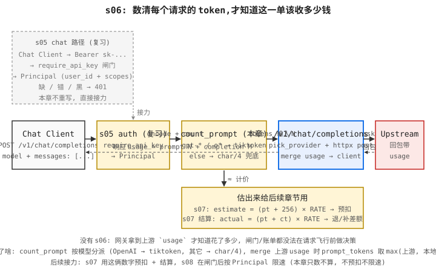

# s06: Token Counting

> Previous: [s05](../s05_api_key_auth/) · Next: [s07](../s07_pre_consume_settle/)
> **Adds**: count prompt tokens pre-flight (tiktoken for OpenAI, char/4 for everything else) and attach the count to the response `usage`. Now we know how much each request will cost before billing the user.

## The Problem

`s05` forwards a request and returns whatever usage the upstream gave us — which is only correct *after* the model has already done the work. We want to:

1. **Quote a price before the call leaves our edge.** Charging-by-token requires a token count up front (or at least in the same response), not on the next reconcile.
2. **Surface usage consistently** even when the upstream doesn't return it (older Claude/Gemini responses, mocked upstreams, partial failures).
3. **Estimate accurately enough to bill reasonably** without paying for a second tokenizer call.

Without this, we either over-bill (assume worst case) or under-bill (forget to count) — both are unfixable once the response is sent.

## The Solution

A `tokenizer` module that picks an estimator based on the model prefix:

| Model prefix | Strategy | Source |
|---|---|---|
| `gpt-`, `o` | `tiktoken` (`cl100k_base`) | `s06_token_counting/tokenizer.py:count_openai` |
| everything else | `len(content) // 4` | `s06_token_counting/tokenizer.py:count_estimate` |

The route handler in `s06_token_counting/code.py:chat_completions` counts prompt tokens *before* forwarding, then after the upstream reply:

- If the upstream already provided a complete `usage` block (with `total_tokens > 0`), keep its `prompt_tokens` but take the **max** of upstream's value and our pre-flight count. This guards against silent under-counting on edge cases.
- Otherwise, synthesize `usage` from our `prompt_tokens` estimate + `len(reply) // 4` for completion.

```
Client ──POST──▶ s06 ──count prompt──▶ Upstream ──reply──▶ merge usage ──▶ Client
                                  └── char/4 fallback for non-OpenAI
```



## How It Works

`tiktoken.get_encoding("cl100k_base")` gives us the same BPE encoder OpenAI uses for `gpt-4*` and `gpt-3.5-turbo`. Per the OpenAI cookbook, every chat message carries a ~4-token overhead (role markers + separators), and we add 2 more for the assistant reply priming.

```python
# s06_token_counting/tokenizer.py
def count_openai(messages, model):
    n = 0
    for m in messages:
        n += 4
        content = m.get("content") or ""
        n += len(_OPENAI_ENCODER.encode(content))
    n += 2  # reply priming
    return n
```

For non-OpenAI models we don't have a tokenizer shipped with the model, so we fall back to the industry rule of thumb: 1 token ~ 4 characters. This is intentionally rough — it's good enough for billing estimates when the upstream isn't OpenAI, and we replace it later (chapter `s11_billing_quotas`) with the real count once we have it.

The dispatcher:

```python
def count_prompt(messages, model):
    if model.startswith(("gpt-", "o")):
        return count_openai(messages, model)
    return count_estimate(messages)
```

## Run It

```bash
cd s06_token_counting
python -c "from s05_api_key_auth.storage import register_key; register_key('u1','sk-tok')"
PORT=8006 python code.py
```

In another shell:

```bash
curl -X POST http://localhost:8006/v1/chat/completions \
  -H 'authorization: Bearer sk-tok' \
  -H 'content-type: application/json' \
  -d '{"model":"gpt-4o-mini","messages":[{"role":"user","content":"hi"}]}'
```

The response now carries:

```json
{
  "usage": {
    "prompt_tokens": 6,
    "completion_tokens": 3,
    "total_tokens": 9
  }
}
```

## Tests

```bash
python -m pytest tests/test_s06_token_counting.py -v
```

Two cases:

1. `test_usage_field_populated` — OpenAI path: response `usage.prompt_tokens >= 1` and `total_tokens >= prompt_tokens`.
2. `test_non_openai_falls_back_to_char_estimator` — Claude path: response `usage.prompt_tokens >= 1` (proves the `count_estimate` branch ran).

Both tests use the shared `upstream_openai` / `upstream_claude` respx fixtures from `tests/conftest.py`.

## → new-api source

- `service/TokenCalculate.go` — the real implementation. It dispatches by provider (OpenAI tokenizer, Claude heuristic, Gemini heuristic), caches per-message results, and returns counts that the billing layer feeds from.

## Trade-offs

- **No streaming token counts yet.** The count is computed on the request; for streaming responses we'll need to count reply tokens as the SSE chunks arrive. That's `s08_streaming_token_counting`.
- **Char/4 is rough.** For Claude/Gemini, accuracy is within ~20% on English prose — fine for soft quota hints, bad for exact billing. Production paths should call the provider's own `/count_tokens` endpoint when available.
- **Overhead is hard-coded.** The 4-tokens-per-message rule is from the OpenAI cookbook; real overhead varies by message role and tool definitions. We accept the small drift for a single chapter; later we read model-specific rules.