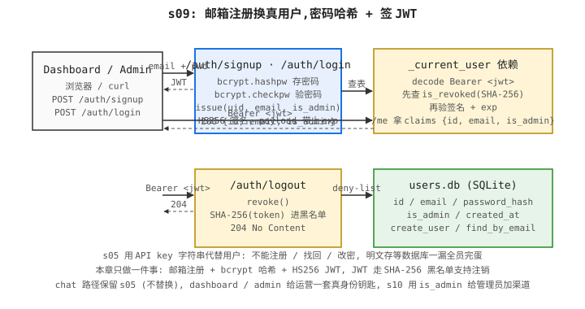

# s09: 用户系统(bcrypt + JWT) — SQLite + bcrypt + JWT,匿名 key 升级成真用户

> Previous: [s08](../s08_rate_limiting/) · Next: [s10](../s10_channel_management/)

> *"注册即有 JWT"* —— 用户系统 = 发证 + 验证。

> **Layer**：L2 鉴权与身份

## 本章要做什么

s05 的"API key → 用户"是一张进程内内存表,key 是明文存的。这套在演示阶段没问题,但一旦系统对外公开就立刻撞墙:用户不能自己注册、不能改密码、不能找回;key 当密码用 = 数据库一旦泄露全员完蛋;进程一重启所有人一起蒸发。

要解决这个,把"匿名 key 持有者"升级成"真用户":邮箱 + 密码注册、用 `bcrypt`（专为密码哈希设计的慢哈希算法,反向暴力破解的成本极高）存密码哈希、用 `HS256` JWT（JSON Web Token：把用户身份信息签名后塞进字符串）发"通行证"、再用这个通行证去访问 dashboard / admin。本章就做这一套:

1. **写 SQLite 用户表 —— 为什么不用 ORM**:SQLite 没有服务端,标准库 `sqlite3` 已经够用,**为什么 ORM 反而是负担**:加 SQLAlchemy 后第一次接触要在 `declarative_base` / `session` / `engine` 三处切换,演示阶段反而挡住"表里到底放了啥"这件事;**为什么 email 加 UNIQUE 约束**:重复注册必须服务端拒掉,不能让两个用户共用一个邮箱;**为什么 sqlite 默认写本地文件**:进程内、零依赖,tutorial 完美。
2. **存密码用 `bcrypt.hashpw` —— 为什么不用 sha256**:`sha256` 是快哈希——攻击者拿到哈希表后能用显卡每秒跑几十亿次;`bcrypt` 故意慢(默认 cost=12,单次约 250 ms),**为什么慢是特性不是 bug**:让"大批量爆破"的成本涨到不可承受;**为什么 `gensalt()` 不传 cost**:用 bcrypt 默认 cost,生产再显式调高;**为什么 login 用 `bcrypt.checkpw`(恒定时间)**:防时序攻击——攻击者通过比对响应时间猜对错,常时间比较把它抹平。
3. **登录成功签 HS256 JWT —— 为什么 JWT 而不是再发一个 API key**:JWT 是无状态的——服务端不用查表就能验签,**为什么不再次发明 API key**:那只是把 s05 的"内存 key 表 + Bearer 头"换个标签,真用户登录后客户端拿的是带签名的"票据",过期前一直可用;**为什么 payload 是 `{sub, email, is_admin, iat, exp}`**:`sub` 是用户 id(industry convention)、`exp` 用来过期、`is_admin` 给后续 dashboard 分角色用;**为什么 secret 走环境变量 `JWT_SECRET`**:`change-me-in-production` 是 tutorial 兜底,默认密钥泄漏后所有人能伪造 token。
4. **挂 `_current_user` 依赖 + SHA-256 黑名单 —— 为什么需要 deny-list**:JWT 一旦签发无法收回——攻击者截获一个还没到期的 token 在过期前都有效,**为什么不靠 token 过期自动作废**:线上常见 24h-7d TTL,出问题不能等那么久;**为什么用 SHA-256(token) 做黑名单 key**:进程转储 / 误日志一行都不会泄露原 token;**为什么是 `is_revoked` 在解码前查**:先黑名单再验签,被撤销的 token 不会再浪费一次验签 CPU。

成品:`curl -X POST .../auth/signup -d '{"email":"a@b.com","password":"secret123"}'` 回 `201 {id, email, access_token}`;`/auth/login` 同邮箱密码回 `200 {access_token, token_type:"bearer"}`;`/me` 带 JWT 头回 `{id, email, is_admin}`;`/auth/logout` 把 token 加进 SHA-256 黑名单后再访问 `/me` 回 `401 token revoked`。后续 s10 用 `is_admin` 给管理员加渠道,s14 在 dashboard 上看调用日志,s16 把 user 写到 trace。

## 上一章复盘

s08 之前所有用户都是匿名的"key 持有者"。没有 `/auth/signup` 这套,就没有"用户"概念。

## 在整体中的位置

鉴权的"用户维度"——s05 用 key 实现粗粒度身份,s09 用 JWT + 注册/登录实现真用户身份。**双轨鉴权其二**：s09 的 JWT 守 dashboard / admin 路径(`/auth/signup`、`/auth/login`、`/auth/logout`、`/me`、admin 路由);chat 路径仍走 s05 的 Bearer API key。两条并存、不替代：s09 不是为了替换 s05，而是给运营/管理面发了"真身份"钥匙,chat 端点继续用 API key 这把"调用钥匙"。

## 问题

s05 之前我们用一张"API key → 用户"的内存表来做鉴权。这种做法在演示阶段没问题,但只要系统对外公开就立刻遇到三个痛点:

1. **没有真正的账号**。用户必须由管理员在服务器上手工签发 key;用户自己无法注册、无法改密码、无法找回。
2. **密码无处存放**。`s05_api_key_auth/storage.py` 里 key 是明文的,把它当成密码等于把数据库泄露出去。
3. **状态是临时的**。进程一重启,所有用户和配额一起蒸发。

说白了,我们现在缺的不是一个新的鉴权机制,而是一张真正的"用户表"——邮箱注册、密码哈希、签发令牌,再用这个令牌代替原来的明文 key 去访问 `/v1/chat/completions`。

## 方案

引入四个最小但够用的部件:

- **SQLite 用户表**(`s09_user_system/users.py`)—— 标准库 `sqlite3`,不引入 ORM。字段:`id / email / password_hash / is_admin / created_at`。`email` 唯一约束,保证重复注册会被拒绝。
- **bcrypt 密码哈希**—— 注册时 `bcrypt.hashpw`,登录时 `bcrypt.checkpw`。永远不存明文,永远不直接比较。
- **HS256 JWT**(`s09_user_system/jwt_util.py`)—— 登录成功签发 `access_token`;`/me` 用 `Depends(_current_user)` 解码 claims。签名密钥来自环境变量 `JWT_SECRET`,默认 `"change-me-in-production"` 仅用于本地开发。
- **Token 黑名单**(`s09_user_system/token_blacklist.py`)—— 进程内集合,键为 `sha256(token).hexdigest()`。`_current_user` 在解码 JWT 之前先检查黑名单——JWT 是无状态的,所以"注销一个尚未到期的 token"必须靠显式 deny-list。

`## 问题` 提了三件痛:用户没法自己注册(痛点 #1)、key 明文存(痛点 #2)、进程一重启全部蒸发(痛点 #3)。这三件事**任何一件**都没法靠"客户端自行保管"或"运维手工签发"能解决——必须由网关把"匿名 key 持有者"升级成"真用户":邮箱注册 + bcrypt 存哈希 + HS256 签 JWT。下面这幅图把这三件事各放到一个角色里:

- **`Client` (浏览器表单 / curl)** —— 在装用户系统之前,这是"管理员手工发 key 才进得去"的角色;装上之后,这事被网关解了——填邮箱密码、拿到 JWT 通行证,后续任何请求都带 `Authorization: Bearer <jwt>`。
- **`Relay` (本章要写的注册 + JWT + 双轨其一)** —— 把痛点 #1 #2 #3 的解决动作集中放在这里:`/auth/signup` 收邮箱密码、`bcrypt.hashpw` 存哈希、签 HS256 JWT 返通行令牌;`/auth/login` 验密码 + 重发令牌;`/me` 走 `Depends(_current_user)` 解码验签 + 查黑名单;`/auth/logout` 把 `sha256(token)` 加进内存 deny-list。chat 路径仍走 s05 Bearer API key——s09 不替换 s05,是给 dashboard / admin 这条面发"真身份"钥匙。
- **`Storage` (users.db + token_blacklist)** —— 持久化与运行时状态两层。`users.db` 是 SQLite 文件,存 `id / email / password_hash / is_admin / created_at`;`token_blacklist` 是进程内 `set[str]`,键为 `sha256(token).hexdigest()`——存内存而不存表,是因为黑名单只在进程寿命内有效、进程重启后由 `exp` 自动兜底。

下面这张块状路由表把本章要写的 4 条接口压成一览:表左是 `method + path`,中间是入参,右是返回码与返回体;本章要写的核心就是这套"注册 → 登录 → 注销 → 读自己"的接口:

```
POST /auth/signup   {email, password}            -> 201 {id, email, access_token}
POST /auth/login    {email, password}            -> 200 {access_token, token_type}
POST /auth/logout   Authorization: Bearer <jwt>  -> 204   (把这个 token 加进黑名单)
GET  /me            Authorization: Bearer <jwt>  -> 200 {id, email, is_admin}
```

注销是**尽力而为**——已经被攻击者截获的旧 token 在被注销前仍然有效(JWT 验签只看签名 + exp,不查黑名单)。需要"立刻全量撤销"的话得上 refresh-token + 黑名单的组合,那是 v2 的事。

下面这张架构图给读者一幅全局鸟瞰——左上角是 s05 chat 路径(本章不变、双轨其一对照),右侧是本章主路径(注册/登录 → /me → /auth/logout),底部挂着 users.db 和 token_blacklist 两个存储:



## 工作原理

**原理**: 一个 HTTP 请求从客户端进来, 它的生命周期分两轨——s09 这条(dashboard / admin): 路由器按 `/auth/signup` 或 `/auth/login` 路径挑出处理器 → 处理器收 `Credentials` schema (`email` + `password`) → signup 走 `bcrypt.hashpw` + `users.create_user` + `jwt_util.issue` 签 HS256 JWT 返通行令牌;login 走 `users.find_by_email` + `bcrypt.checkpw` + `jwt_util.issue` 重签令牌 → 客户端持 JWT 调 `/me` 时,`Depends(_current_user)` 先 `_bearer` 抽 token → 查 `token_blacklist.is_revoked(sha256(token))` → 通过再 `jwt_util.decode` 验签 + 检查 `exp` → 解出 claims 注入 handler;`/auth/logout` 把 `sha256(token)` 加进 `token_blacklist` 内存 set,s09 这条自洽。整章所有部件都为这条主线服务。

**1. 一个 signup handler (`POST /auth/signup`)** —— 收 `Credentials` (`email` + `password` Pydantic schema) → `users.find_by_email` 查重 → 不重就 `bcrypt.hashpw` 算密码哈希 → `users.create_user` 写 SQLite 行 → `jwt_util.issue` 签 HS256 JWT 返 `{id, email, access_token}`。注册即发证。

**2. 一个 login handler (`POST /auth/login`)** —— 同样的 `Credentials` 入参 → `users.find_by_email` 查行 → 找不到或不匹配统一返 `401 invalid credentials`(避免被用来探测哪些邮箱已注册)→ 匹配则 `jwt_util.issue` 重签 token 返 `{access_token, token_type}`。

**3. 一个 JWT encoder/decoder (`jwt_util.issue` + `jwt_util.decode`,HS256 对称签名)** —— payload `{sub, email, is_admin, iat, exp}`,签名密钥 `JWT_SECRET` 走环境变量(默认 `"change-me-in-production"` 仅本地)。`exp` 默认 1 小时,过期前无需查表就能验签——这正是 JWT 优于 session 的地方。

**4. 一个 users storage (`users.py`,SQLite 文件 `users.db`)** —— `users.find_by_email(email) → row | None` + `users.create_user(email, password_hash) → uid` 两个公开函数,字段 `id / email / password_hash / is_admin / created_at`,`email` 加 `UNIQUE` 约束。

**5. 一个 token blacklist (`token_blacklist.py`,进程内 `set[str]`)** —— 键为 `sha256(token).hexdigest()`(不存原 token,防误日志泄露);`is_revoked(token) → bool` + `revoke(token) → None` 两个公开方法。`_current_user` 在 `decode` 之前先 `is_revoked`——先黑名单再验签,被撤销的 token 不会浪费一次验签 CPU。

### `users.py`:SQLite 存储

```python
DB_PATH = Path("/tmp/learn-new-api-users.db")
SCHEMA = """
CREATE TABLE IF NOT EXISTS users (
    id INTEGER PRIMARY KEY AUTOINCREMENT,
    email TEXT UNIQUE NOT NULL,
    password_hash TEXT NOT NULL,
    is_admin INTEGER NOT NULL DEFAULT 0,
    created_at TEXT NOT NULL DEFAULT CURRENT_TIMESTAMP
);
"""
```

- `_conn()` 每次调用都新建连接并执行 `executescript(SCHEMA)`——SQLite 没有服务端,连接很轻,这样写最简单。
- `reset_db()` 删文件;Windows 下文件可能被进程持有,所以回退成 `DELETE FROM users`,测试隔离仍然成立。
- `create_user` / `find_by_email` 是仅有的两个公开函数。

### `jwt_util.py`:最小 HS256 实现

```python
SECRET = os.getenv("JWT_SECRET", "change-me-in-production")

def issue(user_id, email, is_admin, ttl_seconds=3600):
    now = int(time.time())
    payload = {"sub": str(user_id), "email": email,
               "is_admin": is_admin, "iat": now, "exp": now + ttl_seconds}
    return jwt.encode(payload, SECRET, algorithm="HS256")
```

Payload 三个字段:`sub`(用户 id)、`email`、`is_admin`。`exp` 默认 1 小时,签名用 HS256,对称密钥足够本地学习用;生产环境换成 RS256 + 非对称密钥更合适。

### `code.py`:FastAPI 装配

```python
app = FastAPI(title="learn-new-api s09")
app.mount("/", s08_app)               # s08 的 /v1/chat/completions 原样保留

@app.post("/auth/signup", status_code=201)
def signup(creds: Credentials):
    if users.find_by_email(creds.email):
        raise HTTPException(409, "email already registered")
    pw_hash = bcrypt.hashpw(creds.password.encode(), bcrypt.gensalt()).decode()
    uid = users.create_user(creds.email, pw_hash)
    return {"id": uid, "email": creds.email,
            "access_token": jwt_util.issue(uid, creds.email, is_admin=False)}

def _bearer(request: Request) -> str:
    auth = request.headers.get("authorization", "")
    if not auth.startswith("Bearer "):
        raise HTTPException(401, "missing token")
    return auth.removeprefix("Bearer ").strip()

def _current_user(request: Request) -> dict:
    token = _bearer(request)
    if token_blacklist.get_default().is_revoked(token):
        raise HTTPException(401, "token revoked")
    try:
        return jwt_util.decode(token)
    except Exception:
        raise HTTPException(401, "invalid token")

@app.post("/auth/logout", status_code=204)
def logout(request: Request):
    token = _bearer(request)        # 401 if missing
    token_blacklist.get_default().revoke(token)
    return None

@app.get("/me")
def me(claims: dict = Depends(_current_user)):
    return {"id": int(claims["sub"]),
            "email": claims["email"],
            "is_admin": claims.get("is_admin", False)}
```

三条设计要点:`_bearer` 把"提取 token"抽出来一处,`_current_user` 在解码前先查黑名单(用 SHA-256 算出的摘要做 key,不是原始 token),`/auth/logout` 走 `_bearer` 复用同一份解析逻辑。共用 `_bearer` 看起来是小事,但少了它,"什么算合法 Bearer 头"就会在每个 handler 里被重复实现一遍,迟早某个分支写错。

登录失败统一返回 `401 invalid credentials`——不区分"邮箱不存在"和"密码错误",避免被用来探测哪些邮箱已注册。注销后再访问 `/me` 返回 `401 token revoked`,跟"密码错"区分开——给客户端一个明确的"你的 token 被显式作废了"信号,而不是让它以为只是密码又错了。

## 运行

```bash
# 第一次:先 s08 准备好环境
export UPSTREAM_OPENAI_KEY=sk-...

# 起服务
python s09_user_system/code.py        # PORT 默认 8009
```

确认注册 + 登录 + `/me` + logout 流程能跑通?打这套 curl——注册返回 `201 + access_token`、登录返回 `200 + access_token`、`/me` 返回 `{id,email,is_admin}`、注销后 `/me` 再访问返 `401 token revoked`,四步都正常就说明 users.db + bcrypt + JWT + token_blacklist 注册-登录-查询-注销四步都跑通了:

```bash
# 注册
curl -s -X POST http://localhost:8009/auth/signup \
  -H 'content-type: application/json' \
  -d '{"email":"a@b.com","password":"secret123"}'
# -> {"id":1,"email":"a@b.com","access_token":"eyJ..."}

# 登录
TOKEN=$(curl -s -X POST http://localhost:8009/auth/login \
  -H 'content-type: application/json' \
  -d '{"email":"a@b.com","password":"secret123"}' | python -c "import sys,json;print(json.load(sys.stdin)['access_token'])")

# /me
curl -s http://localhost:8009/me -H "authorization: Bearer $TOKEN"
# -> {"id":1,"email":"a@b.com","is_admin":false}

# 注销(撤销这个 token)
curl -s -X POST http://localhost:8009/auth/logout \
  -H "authorization: Bearer $TOKEN"
# -> 204 No Content

# 之后再访问 /me 用同一个 token:
curl -i http://localhost:8009/me -H "authorization: Bearer $TOKEN"
# -> 401 {"detail":"token revoked"}
```

`JWT_SECRET` 强烈建议设置;不设置的话所有进程重启后旧 token 仍能用默认 `"change-me-in-production"` 验签——只是别把它带到线上。

## → new-api 源码

- `controller/user.go` —— 注册、登录、注销等 HTTP 处理器;新-api 在这里把表单/JSON 绑定到 `model.User`,再交给 service。
- `model/user.go` —— `User` struct、密码哈希字段、`BeforeCreate` 钩子里调用 bcrypt;和我们这里的 `users.py` 一一对应。
- `service/user_notify.go` —— 通知/邮件相关扩展;本教程暂不涉及。

## 本章不做什么

- **不做邮箱验证 / 找回密码 / 刷新令牌 / 注册限流** —— YAGNI。这一章只解决"能不能让用户登录",剩下的留给 s10 之后按真实需求加。
- **chat 路径仍走 s05 API key** ——s09 不替换 s05 的 `Depends(require_api_key)` 闸门,chat 端点继续用 API key 这把"调用钥匙"。`/v1/chat/completions` 收到的 Bearer 仍是 `sk-...`,不是 `eyJ...`。两条并存,不替代。
- **没有管理后台路由** (`/admin/*` 给管理员看的页面/接口)——`is_admin` 字段已经从 JWT payload 里取出来了,但本章还没写任何 `/admin/*` 路由去读它。→ s10 用 `is_admin` 给管理员加渠道。

## 已知限制

- **HS256 + 对称密钥** ——学习和本地开发足够;线上推荐 RS256 + JWKS,因为前端不能拿私钥验签。
- **SQLite 文件锁** (单写者文件锁,多 writer 串行化)——单进程够用;多 worker 时 `find_by_email` 会拿不同连接,存在"同一时刻读到两条刚 commit 的 row"的窗口,s12 之后切到 Postgres 再讨论并发。
- **默认密钥硬编码** (`change-me-in-production` 编译进二进制字符串)——仅用于演示;`JWT_SECRET` 必须设置,至少 32 字节随机串。PyJWT 会发出 `InsecureKeyLengthWarning`,是预期内的。
- **token_blacklist 是进程内 `set`** ——进程一重启黑名单清空,已签发的 token 仍由 `exp` 兜底;多 worker 时每个 worker 各持一份黑名单,某 worker 撤销的 token 在别的 worker 仍能用直到 `exp`。上 Redis 共享黑名单是后续优化项。

## 设计选择

- **JWT 而不是再发一个 API key** (JSON Web Token:把用户身份签名后塞进字符串 / vs 新建一张 key 表)——JWT 是无状态的,服务端不用查表就能验签;再发明 API key 只是把 s05 的"内存 key 表 + Bearer 头"换个标签。代价是 JWT 一旦签发无法收回——必须配 deny-list 弥补这一项。
- **黑名单用 SHA-256(token) 而不是 token 原文** (密码哈希常用的一种做法)——进程转储 / 误日志一行都不会泄露原 token;攻击者拿到 sha256 也无法用去刷 `Authorization` 头(因为原 token 才会被服务端签发)。
- **HS256 而不是 RS256** (对称签名密钥 / vs 非对称签名)——对称密钥本地学习足够简单,无需管 JWKS / 公钥分发;线上推荐 RS256 + JWKS,但那会增加教程的表面积。
- **`is_revoked` 在 `decode` 之前查** ——先黑名单再验签,被撤销的 token 不会再浪费一次验签 CPU;SHA-256 摘要比较比 PyJWT 验签便宜几个数量级。

## 下章预告

s09 把"用户"立起来,但只有一个可用的 OpenAI 通道。s10 让管理员增删渠道、改优先级,流量按策略分摊。